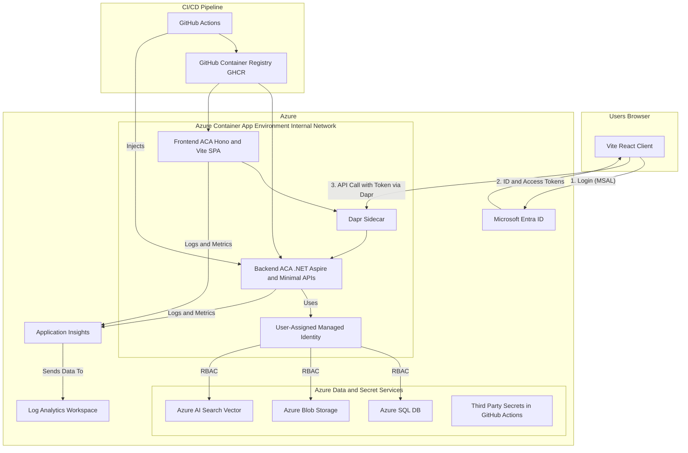

# ☁️ Cloud-Native Architecture

This document provides the holistic, end-to-end architecture for deploying, securing, and operating the Azure ACA Aspire AI Starter Template on Microsoft Azure. It connects the application design to the underlying cloud infrastructure, focusing on security, automation, observability, and cost-awareness. The architecture is designed to integrate cleanly with **.NET Aspire**, **ACA**, **Dapr**, and a **Vite + Hono** frontend.

---

## 🎯 Core Principles

1. **Zero-Trust Security**: No component is trusted by default. All interactions, from user to frontend, frontend to backend, and backend to Azure services, must be authenticated and authorized.
2. **Infrastructure as Code (IaC)**: The entire cloud environment is defined in code, ensuring it is reproducible, version-controlled, and can be deployed automatically.
3. **Automation**: The entire lifecycle, from code commit to deployment, is automated via a CI/CD pipeline.
4. **Comprehensive Observability**: The system is designed to be observable, with structured logging, metrics, and tracing enabled across all components.
5. **Cost Awareness**: Optimize for free-tier and consumption-based pricing to keep PoC costs minimal while maintaining enterprise alignment.

---

## 📊 Overall Architecture Diagram

---

## Component Breakdown & Flows

### 1. Authentication & Service Communication Flow

1. **Frontend Authentication**: User accesses the React SPA served by the Hono frontend host. If authentication is enabled, the host can coordinate token exchange or session handling with **Microsoft Entra ID**.
2. **Token Acquisition**: After login, Entra ID issues the required identity or access tokens. Sensitive token-handling logic stays in the frontend host or backend, not in static assets.
3. **Dapr Service Invocation**: The frontend host calls backend APIs via the Dapr sidecar using service invocation. Host-managed headers or server-side credentials can be attached when required.
4. **Backend Token Validation**: Backend validates JWT tokens against Entra ID, processing requests only if valid.

### 2. Secure Backend Integrations with Managed Identity

* **Identity Provider**: Backend ACA assigned a **User-Assigned Managed Identity**.
* **RBAC Roles**:

  * Azure SQL: `db_datareader`, `db_datawriter`
  * Azure Blob: `Storage Blob Data Contributor`
  * Azure AI Search: data/query plane access for vector retrieval operations
* **Third-Party Secrets**: HF/OpenAI keys stored in **GitHub Actions secrets**, injected at deploy.
* **Configuration**: Backend uses `DefaultAzureCredential` in Aspire to authenticate seamlessly with Azure resources.

### 3. Infrastructure as Code (IaC) & CI/CD

* **IaC with Bicep**: Entire Azure environment (ACA, DBs, storage, identities) is defined in Bicep.
* **CI/CD with GitHub Actions**:

    1. Build & test frontend (Vite + Hono) and backend (.NET Aspire).
  2. Build container images and push to GHCR (or a managed ACR).
  3. Deploy infra via Bicep.
  4. Initialize the SQL schema from the seed script on startup.
  5. Deploy ACA revisions with rollout strategies.

### 4. Observability & Monitoring

* **Centralized Logging**: All ACA logs to **Log Analytics Workspace**.
* **App Insights**: Integrated for both frontend (via SDK) and backend (via OTel from Aspire).
* **Distributed Tracing**: Correlation IDs flow from frontend to backend via Dapr.
* **Core Web Vitals**: Captured from frontend for UX monitoring.

---

## 🌐 Networking & Security

* **Ingress**: Only frontend ACA exposed publicly via custom domain + TLS.
* **Internal Only**: Backend ACA internal, accessible only via Dapr.
* **Secrets**: GH Actions secrets → injected into Aspire → ACA env vars.
* **Cost Controls**: Skipping Key Vault, Private Endpoints, Defender in PoC.

---

## 🔒 Enterprise-Grade Optional Enhancements

For production:

* Private Endpoints for all data services.
* Azure Key Vault for centralized secret management.
* Defender for Cloud for container security and compliance.

In PoC:

* Secure defaults with Managed Identity, HTTPS, and secret injection via CI/CD.

---

## ✅ Success Criteria

* ACA runs FE (Hono-hosted Vite SPA) and BE (.NET Aspire minimal APIs) with Dapr.
* Azure SQL, Blob, and AI Search vector retrieval all integrated.
* Aspire orchestrates local and cloud deployments consistently.
* Observability wired with free App Insights/Log Analytics.
* CI/CD fully automated with GHCR and GH Actions.
* Secure flows in place while staying within free-tier/consumption limits.
